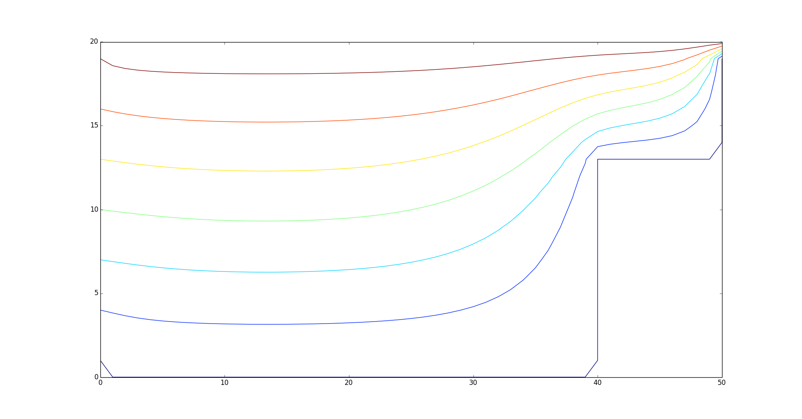

Partial differential equation solvers written in Haskell.

Doesn't do much now. Laplace for Δφ=0. Run it like this:

```
$ cabal build
$ dist/build/laplaceSimple/laplaceSimple examples/out.txt 1000
$ python3 plotmatrix.py examples/out.txt  
```

Which displays the above image, and prints something like 
the following to the screen:

```
array([[ -5.        ,    0.        ,    0.        , ...,    0.        ,
          0.        ,    0.        ],
      [   0.        ,    2.50806877,    3.50406057, ...,    0.        ,
          0.        ,    0.        ],
      [   5.        ,    6.52822698,    7.53229049, ...,    0.        ,
          0.        ,    0.        ],
         ...,
      [  85.        ,   86.52820002,   87.53223393, ...,   45.84375925,
         28.12781024,    0.        ],
      [  90.        ,   92.5080546 ,   93.50403084, ...,   67.71471854,
         48.96063209,    0.        ],
      [ 100.        ,  100.        ,  100.        , ...,  100.        ,
        100.        ,  100.        ]])
```
